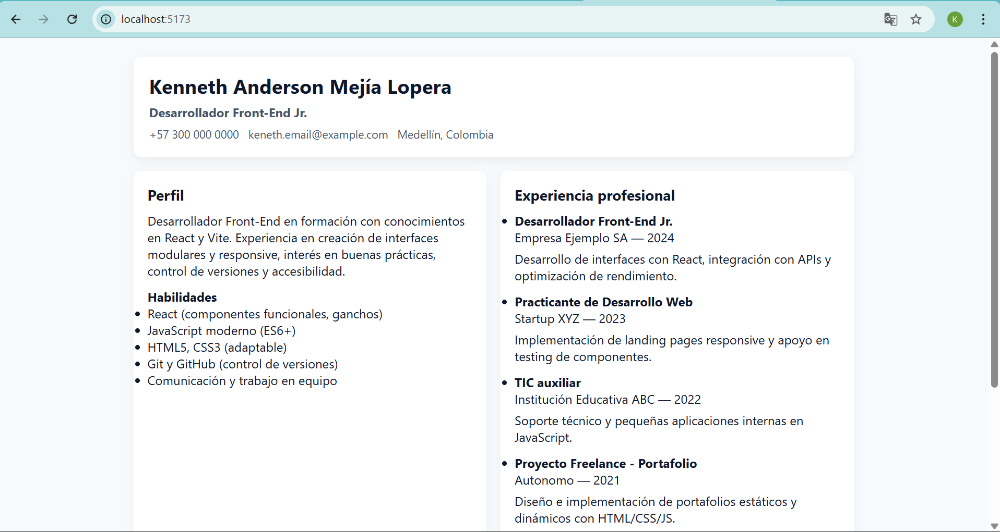

# CV React - Keneth Anderson Mejia Lopera

Proyecto: Hoja de vida (CV) modular creada con React + Vite.

## Estructura
- `src/components/` - Componentes: CabeceraCV, Perfil, Experiencia, Educacion
- `App.jsx` - Componente principal que orquesta todo


## Imagen de navegador


## Cómo ejecutar (local)
1. Instalar dependencias:
   ```bash
   npm install
2. Npm run dev
3. copiar y pegar la url en el navegador

